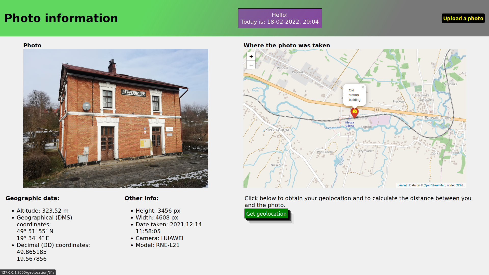

# Photo info App
App where you can extract the EXIF Data from a photo.

## Table of Contents
* [General info](#general-info)
* [Technologies Used](#technologies-used)
* [Features](#features)
* [Screenshots](#screenshots)
* [Setup](#setup)
* [Usage](#usage)
* [Project Status](#project-status)

## General info
This project was made to experiment with the EXIF Data from the photo. It is a standard that specifies information
related to an image (or other media used by digital cameras).  
The main aim was to get the Coordinates from the photo and display in on a map. The next step was to get a geolocation
of a user and show it on the map.

## Technologies Used
Project was created with:
* Python version: 3.6.9
* Django version: 3.2.12
* psycopg2-binary version: 2.9.3
* Pillow version: 8.4.0
* piexif version: 1.1.3
* folium version: 0.12.1.post1
* geopy version: 2.2.0

## Features
* Main page where you can upload a photo and show five recently added photos
* Get EXIF Data from the photo - geographical coordinates, altitude, photo size, date taken, camera name and its model
* Geographical coordinates (DMS) converter to decimal coordinates (DD)
* Show the photo's location on the map
* Get user geolocation
* Calculate the distance between the position of a user and the photo taken. The distance is shown on a map

## Screenshots

### Upload_photo page:

### Photo_info page:

### Geolocation page:

## Setup
Project requirements are in _requirements.txt_.  
To get started:
* `pip install -r requirements.txt`
* `python manage.py migrate`
* `python manage.py runserver`

## Usage
* After you clone this repo to your desktop, go to its root directory and run `pip install -r requirements.txt`
to install its dependencies
* When the dependencies are installed, make migrations `python manage.py migrate` and run server 
`python manage.py runserver` to start application
* You will be able to access it at `127.0.0.1:8000/upload_photo`

## Project Status
Project is _complete_.

## Contact
Created by 117marta - feel free to contact me!
